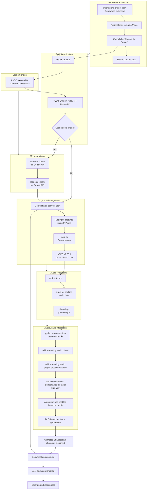

# Shakespeare AI : Vision + Realtime conversation + Facial Animation

An immersive experience allowing for real-time conversation with the digital twin of William Shakespeare. The conversations are context-aware as well as visually engaging with facial animations. It has vision capabilities as well, giving the user the ability to show images to Shakespeare and talk about them. The model has been fine-tuned by training on over 5M+ characters of Shakespeare's works.
<br> The project leverages:
- `Gemini` API for image analysis and context generation. We're using the `gemini-1.5-turbo` model.
- `Convai` API for real-time conversation. We're using voices from `ElevenLabs` to generate natural-sounding speech.
- NVIDIA Omniverse's `Audio2Face` for facial animation as well as `DLSS` for frame generation to optimize performance.

> [!IMPORTANT]
> I have cancelled the convai subscription, so the application will start throwing errors right out of the box starting Nov 11 2024, if you need continued support email me at: [rajnish.ankt@gmail.com](mailto:rajnish.ankt@gmail.com) 

https://github.com/user-attachments/assets/a5c6bad6-4440-499c-924f-e3f915e5ca15

## Setup 

https://github.com/user-attachments/assets/4bbda9dd-0374-48f6-9107-c716358358af

- Install NVIDIA Omniverse Launcher and Audio2Face. Follow steps 1, 2 and 4 from the instructions listed [here](https://docs.omniverse.nvidia.com/install-guide/latest/workstation-install.html).
- Ensure that you have the necessary system requirements for running Omniverse listed [here](https://docs.omniverse.nvidia.com/materials-and-rendering/latest/common/technical-requirements.html).

- After installing ominverse, you can choose to set up the project in one of the two ways:

    - **Load Manually**
        - Clone the repository:
            ```
            git clone https://github.com/yourusername/shakespeare-ai.git
            ```
        - Open Audio2Face go to ` Window > Extensions > Hamburger Menu Icon > Settings` and add the path to the `exts` folder in the repository.

    - **Load directly from GitHub**
        - Make sure you have `git` installed on your system.
        - Open Audio2Face go to ` Window > Extensions > Hamburger Menu Icon > Settings` and add `git://github.com/aniketrajnish/Omniverse-Shakespeare-Project?branch=main&dir=omni/shakespeare-ai/exts`.
        - In case the above method doesn't work, follow the manual method.

- **If you are on a windows machine, you don't need to install any python dependencies as the project uses a compiled PyQt5 executable.**
- But in case you wish to run the python scripts:
    - You can install the dependencies using:
        ```
        cd app\src
        pip install -r requirements.txt
        ```
    - Paste your API keys:
        - Get your `Gemini` API key from [here](https://ai.google.dev/gemini-api/docs/api-key), paste it in `app\src\gemini\gemini.env` next to `API_KEY`.
        - Get your `Convai` API key from [here](https://docs.convai.com/api-docs/convai-playground/get-started), paste it in `app\src\convai\convai.env` next to `API_KEY`.

- To optimize for performance, you can enable `DLSS` in Audio2Face by going to `RTX - Real-Time > Settings Hambuger Icon > NVIDIA DLSS > check Frame Generation`. You need to do this every time you open `Audio2Face`.

## Usage
- Enable the extension from `Window > Extensions > Third-Party > Shakespeare AI Server`.
- If this is the first time you're using Audio2Face, it will take some time to load the `TensorRT` engine. You can check the progress in the `Audio2Face Tool` window.
- The extension will open a window with two buttons: `Open Project` and `Connect to Server`.
- Click on `Open Project` to load the project in Audio2Face having the Shakespeare character along with streaming audio player set up.
- Click on `Connect to Server` to start the server and open the PyQt5 executable.
- The executable will connect to the server and you can start interacting with the Shakespeare character.
- You can either select an image to show to Shakespeare or start talking directly.

> [!CAUTION]
> You can directly run the executable from `app/build` folder without having to install `Omniverse` to get a feel of the real-time conversation as well as vision capabilities minus the facial animation and visual experience. **But it might run into threading issues as the backend has been designed to work with `Audio2Face` streaming audio player.**

## How it works

- **Project Initialization:**
    - The user opens the project from the Omniverse extension.
    - The project loads in Audio2Face.
- **Server Connection:**
    - The user connects to the socket server from the extension.
    - This action starts a socket server and opens a compiled PyQt5 executable.
- **User Interaction:**
    - Users can choose to select an image or start talking directly.
    - If an image is selected, it's sent to the `Gemini` API for analysis.
    - The context generated is updated in the `Convai` API to update the conversation context.
- **Conversation Flow:**
    - Microphone input is captured using `PyAudio`.
    - User speech is sent to the `Convai` service via `gRPC`.
    - The response is generated in shakespearean style and sent back.
- **Audio Processing:**
    - The audio response is processed using the `pydub` library.
    - Processed audio is sent to the Audio2Face socket server in chunks.
    - The audio is added to a queue using `threading.Condition`.
    - Clicks between audio chunks are also removed using `pydub`.
- **Facial Animation & Display:**
    - Audio is sent in chunks to the `Audio2Face` streaming audio player
    - The audio is processed and converted to blendshapes for facial animation.
    - Auto emotions are enabled based on the audio.
    - `DLSS` is used for frame generation to optimize performance.
    - The animated Shakespeare character is displayed, speaking the generated response.
- **Conversation Loop:**
    - The conversation continues until the user ends it.
    - At the end, the system cleans up and disconnects.

## Contributing
Pull requests are welcome. For major changes, please open an issue first to discuss what you would like to change. Currently working on-
- Packaging the experience into a standalone application.
- Incorporating idle animations in Audio2Face. 

## License
MIT

## Thanks
- Aamir Vora - Facial artist for Shakespeare [ [LinkedIn](https://www.linkedin.com/in/aamir-vora-244013201/) | [ArtStation](https://aamirvora251299.artstation.com/) ]
