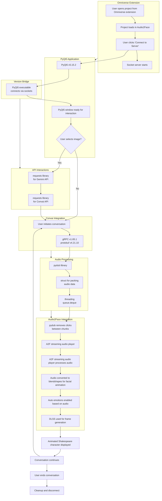

# Shakespeare AI : Vision + Realtime conversation + Facial Animation

## How it works

```mermaid
graph TD
    A[User opens project from Omniverse extension] --> B[Project loads in Audio2Face]
    B --> C[User clicks 'Connect to Server']
    C --> D[Socket server starts] & E[PyQt5 executable opens]
    E --> F[Executable connects to socket server]
    F --> G[PyQt5 window ready for interaction]
    G --> H{User selects image?}
    H -->|Yes| I[Image sent to Gemini API]
    I --> J[Update Shakespeare context in Convai API]
    H -->|No| K[User initiates conversation]
    J --> K
    K --> L[Convai generates audio response via gRPC]
    L --> M[Audio processed with pydub]
    M --> N[Processed audio sent to A2F socket server]
    N --> O[Audio added to queue using threading.Condition]
    O --> P[pydub removes clicks between chunks]
    P --> Q[Audio sent in chunks to A2F streaming audio player]
    Q --> R[A2F streaming audio player processes audio]
    R --> S[Audio converted to blendshapes for facial animation]
    S --> T[Auto emotions enabled based on audio]
    T --> U[DLSS used for frame generation]
    U --> V[Animated Shakespeare character displayed]
    V --> W[Conversation continues]
    W --> K
    W --> X[User ends conversation]
    X --> Y[Cleanup and disconnect]

    subgraph Omniverse[Omniverse Extension]
        A
        B
        C
        D
    end

    subgraph Bridge[Version Bridge]
        D[Socket server starts]
        F[PyQt5 executable<br>connects via sockets]
    end

    subgraph PyQt[PyQt5 Application]
        E[PyQt5 v5.15.2]
        G
        H
    end

    subgraph API[API Interactions]
        I[requests library<br>for Gemini API]
        J[requests library<br>for Convai API]
    end

    subgraph Convai[Convai Integration]
        K
        L[gRPC v1.65.1<br>protobuf v4.21.10]
    end

    subgraph Audio[Audio Processing]
        M[pydub library]
        N[struct for packing<br>audio data]
        O[threading<br>queue.deque]
    end

    subgraph A2F[Audio2Face Integration]
        P[pydub removes clicks<br>between chunks]
        Q[A2F streaming audio player]
        R
        S
        T
        U
    end

    %% Adjust layout for 16:9
    Omniverse --> PyQt
    Bridge --> API
    Convai --> Audio
    Audio --> A2F
```
